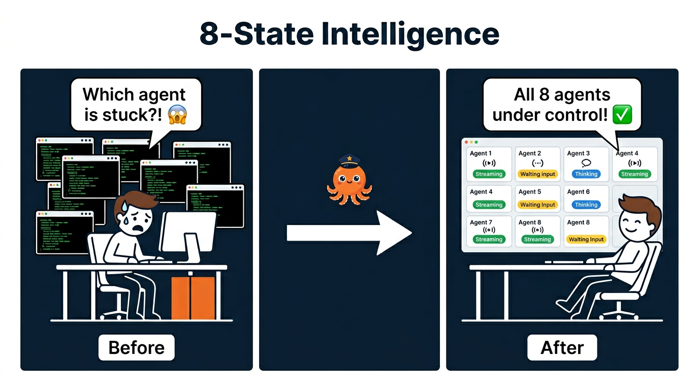
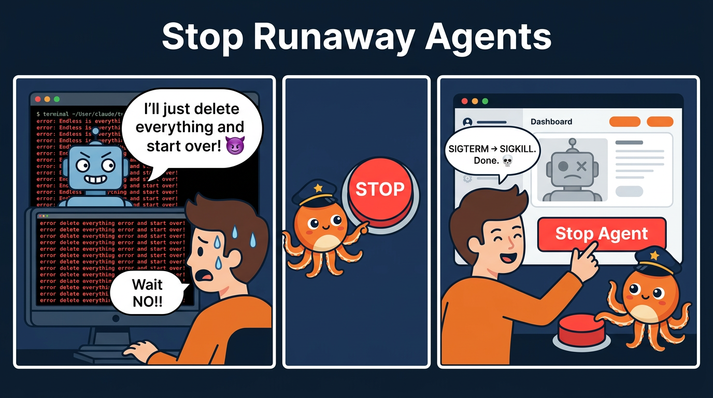
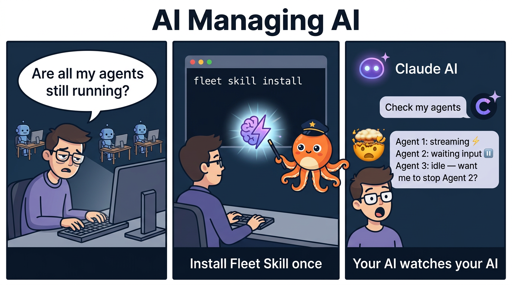
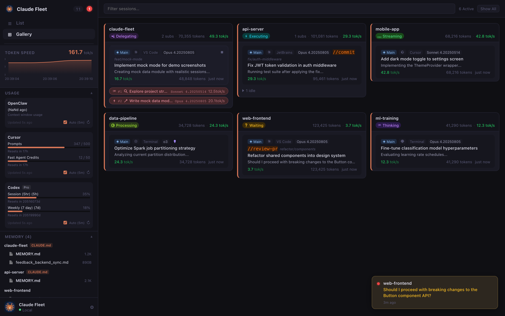
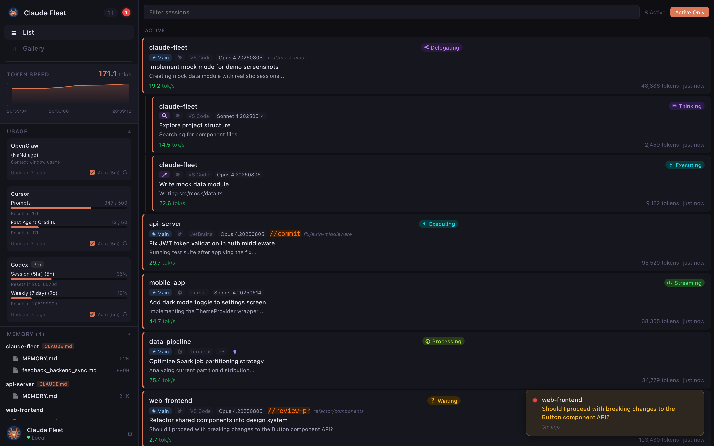
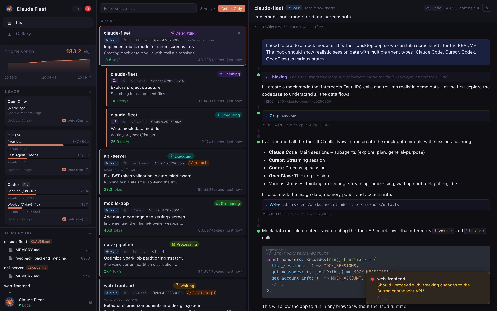
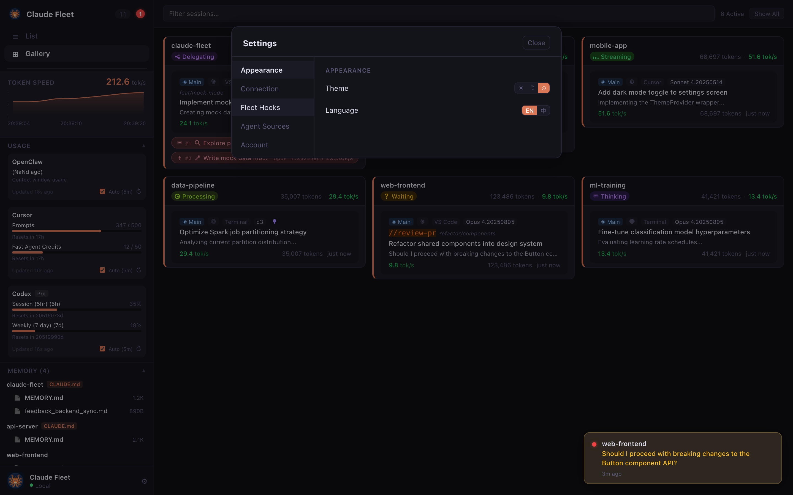
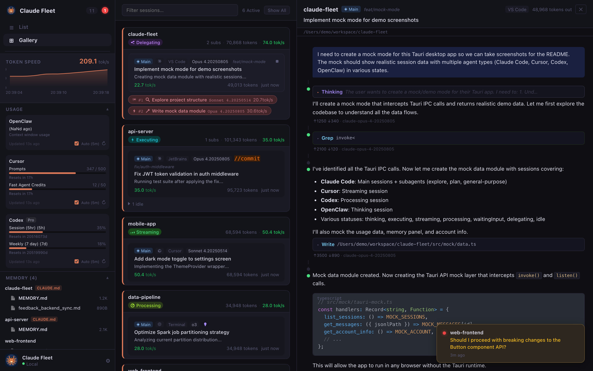
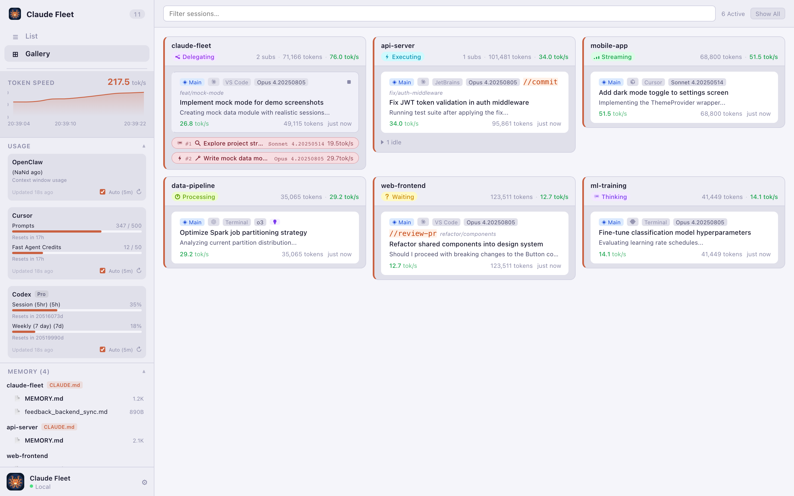

<div align="center">


# Claude Fleet

**Mission control for your AI coding agents.**
Monitor every session, track token throughput, and inspect full conversation histories — all from one place.
Supports **Claude Code**, **Cursor**, **OpenClaw**, and **Codex**.

[](https://github.com/hoveychen/claude-fleet/releases/latest)
[](LICENSE)
[](https://github.com/hoveychen/claude-fleet/releases/latest)
[](https://tauri.app)
[](https://react.dev)
[](https://www.typescriptlang.org)

</div>

---


## What is Claude Fleet?

When you run Claude Code across multiple projects simultaneously — or lean on its multi-agent delegation feature — it's easy to lose track of what each agent is doing, how fast it's working, or whether it's stuck waiting for your input.

**Claude Fleet** solves this by watching Claude Code's local session files in real time and presenting everything in a clean dashboard. No server required, no API key needed beyond what Claude Code already uses.

> **Meet Captain Octo** 🐙 — our mascot. Eight tentacles for eight agents running in parallel. He keeps the fleet in order.

---

## Supported Agents

Claude Fleet can monitor sessions from multiple AI coding agents:

| | Agent | Status |
|---|---|---|
|  | **Claude Code** | Fully supported — enabled by default |
|  | **Cursor** | Supported — opt-in via Settings |
|  | **OpenClaw** | Fully supported |
|  | **Codex** | Fully supported |

> Toggle agent sources on or off in the app's Settings panel. Claude Fleet auto-detects which tools are installed on your system.

---

## Why Claude Fleet?

<div align="center">



</div>

---

## Screenshots

<table>
<tr>
<td width="50%"><strong>Gallery View</strong> — multi-agent dashboard</td>
<td width="50%"><strong>List View</strong> — active & idle sessions</td>
</tr>
<tr>
<td></td>
<td></td>
</tr>
<tr>
<td><strong>Session Detail</strong> — conversation, thinking blocks & code</td>
<td><strong>Settings</strong> — sources, hooks, appearance</td>
</tr>
<tr>
<td></td>
<td></td>
</tr>
<tr>
<td><strong>Gallery + Detail Panel</strong></td>
<td><strong>Light Theme</strong></td>
</tr>
<tr>
<td></td>
<td></td>
</tr>
</table>

---

## Features

**Zero configuration.** Claude Fleet reads Claude Code's local session files directly — no server, no extra API key, no setup beyond installing the app.

| | Feature | Details |
|---|---|---|
| 🧠 | **8-State Intelligent Status** | Distinguishes `thinking` · `executing` · `streaming` · `processing` · `waiting input` · `active` · `delegating` · `idle` — inferred from content blocks and file modification time, not just polling |
| 🌲 | **Multi-Agent Hierarchy** | Gallery view groups parent sessions with their spawned subagents; idle parents auto-promote to `delegating` when children are still running |
| ⚡ | **Real-Time Token Speed** | Scrolling area chart of aggregate tokens/s across all active agents; per-agent speeds shown on each card |
| 🔍 | **Full Conversation Inspection** | Browse complete message history with rendered Markdown, syntax-highlighted code, collapsible thinking blocks, and tool use/result pairs |
| 🛑 | **Stop Agents** | Kill any running session directly from the dashboard — sends SIGTERM then SIGKILL to the full process tree |
| 📊 | **Rate-Limit Dashboard** | Live utilization bars for the 5-hour and 7-day usage windows, with trend comparison to the previous cycle so you know before you hit the wall |
| 💻 | **`fleet` CLI** | Standalone binary for terminal use: `fleet agents`, `fleet stop <id>`, `fleet account`, `fleet speed` — all with `--json` output for scripting |
| 🤖 | **Fleet Skill** | One-click install of a Claude Code / Cursor / Copilot skill that lets your AI assistant monitor and stop other agents autonomously |
| 🔔 | **System Tray** | Lives in your menu bar with a live agent-count badge; never clutters your taskbar |

---

## Installation

Download the latest pre-built binary for your platform from the [Releases page](https://github.com/hoveychen/claude-fleet/releases/latest):

| | Platform | Architecture | Download |
|---|---|---|---|
|  | macOS | Apple Silicon (M1/M2/M3/M4) | [claude-fleet-macos-arm64.dmg](https://github.com/hoveychen/claude-fleet/releases/latest/download/claude-fleet-macos-arm64.dmg) |
|  | macOS | Intel | [claude-fleet-macos-x64.dmg](https://github.com/hoveychen/claude-fleet/releases/latest/download/claude-fleet-macos-x64.dmg) |
|  | Windows | x64 | [claude-fleet-windows-x64-setup.exe](https://github.com/hoveychen/claude-fleet/releases/latest/download/claude-fleet-windows-x64-setup.exe) |
|  | Windows | ARM64 | [claude-fleet-windows-arm64-setup.exe](https://github.com/hoveychen/claude-fleet/releases/latest/download/claude-fleet-windows-arm64-setup.exe) |
|  | Linux | x86\_64 | [claude-fleet-linux-x64.deb](https://github.com/hoveychen/claude-fleet/releases/latest/download/claude-fleet-linux-x64.deb) · [claude-fleet-linux-x64.AppImage](https://github.com/hoveychen/claude-fleet/releases/latest/download/claude-fleet-linux-x64.AppImage) |
|  | Linux | ARM64 | [claude-fleet-linux-arm64.deb](https://github.com/hoveychen/claude-fleet/releases/latest/download/claude-fleet-linux-arm64.deb) · [claude-fleet-linux-arm64.AppImage](https://github.com/hoveychen/claude-fleet/releases/latest/download/claude-fleet-linux-arm64.AppImage) |

### Prerequisites

Claude Fleet reads session data written by **Claude Code** (`claude` CLI). You need Claude Code installed and have run at least one session before anything shows up.

---

## Build from Source

### Requirements

- [Rust](https://rustup.rs) (stable, 1.77+)
- [Node.js](https://nodejs.org) 20+
- [Tauri CLI v2](https://tauri.app/start/prerequisites/)

### Steps

```bash
git clone https://github.com/hoveychen/claude-fleet.git
cd claude-fleet

npm install

# Development (hot-reload)
npm run tauri dev

# Production build
npm run tauri build
```

The output binary and installer are placed under `src-tauri/target/release/bundle/`.

---

## How It Works

Claude Fleet reads directly from Claude Code's local data directory (`~/.claude/`) — no network calls, no background services, nothing you need to configure.

```
~/.claude/
├── ide/
│   └── *.lock          ← active IDE process info (pid, workspace, auth token)
└── projects/
    └── <workspace>/
        └── *.jsonl     ← append-only conversation history (one JSON object per line)
```

1. **Startup** — scans all `.lock` files to find live IDE processes
2. **File watcher** — uses OS-native events (FSEvents on macOS, inotify on Linux) to detect new JSONL lines the moment Claude writes them
3. **Status inference** — derives session state from the last assistant message's `stop_reason` field and file modification time
4. **Token speed** — aggregates `usage.output_tokens` across the most recent messages and divides by elapsed time

Everything runs in-process inside the Tauri Rust backend. The React frontend communicates via Tauri's IPC bridge.

---

## Contributing

Pull requests are welcome! A few pointers:

- **Backend** is Rust in `src-tauri/src/` — `session.rs` owns session parsing, `watcher.rs` owns the file-system loop
- **Frontend** is React + TypeScript in `src/` — components use CSS Modules, state is managed with Zustand
- **i18n** — locale files live in `src/locales/`; copy `en.json`, translate, register in `src/i18n.ts`

Please open an issue before starting large changes so we can coordinate.

By submitting a pull request, you agree to the [Contributor License Agreement (CLA)](CLA.md). The CLA grants the project owner the right to relicense contributions under other licenses (including commercial ones) while keeping the public release under AGPL-3.0.

---

## License

This project is licensed under the [GNU Affero General Public License v3.0](LICENSE) (AGPL-3.0-only).

Copyright © 2025 hoveychen

Under AGPL-3.0, if you run a modified version of this software to provide a service over a network, you must make the complete source code of your modified version available to users of that service.
