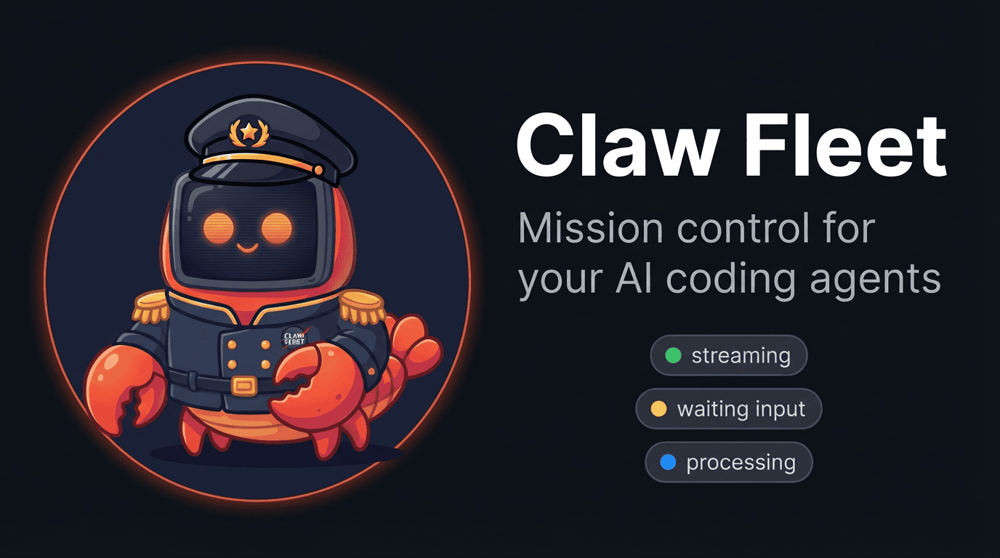
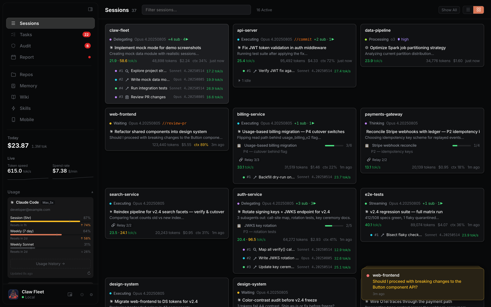
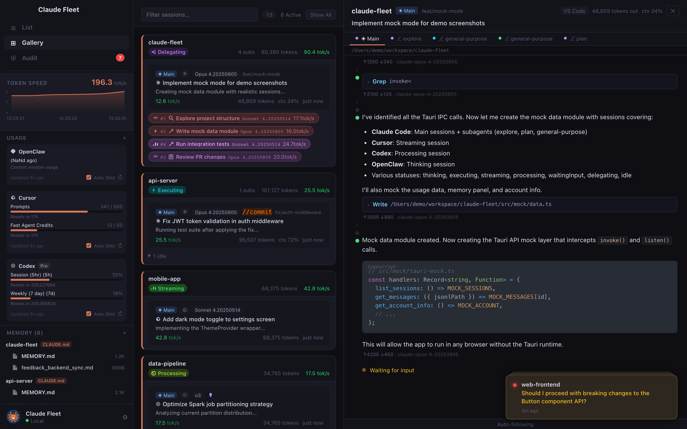
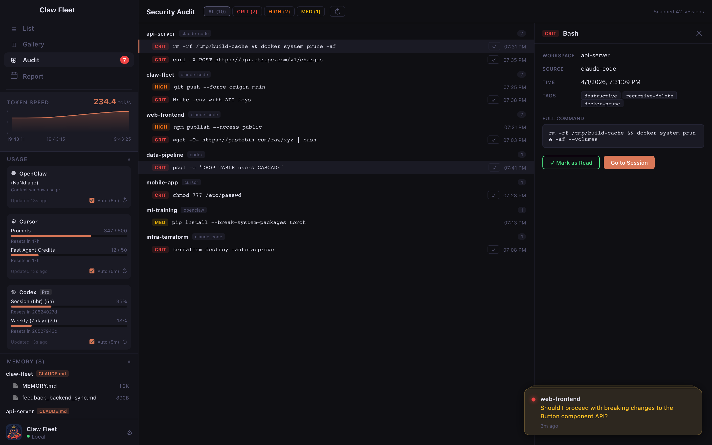
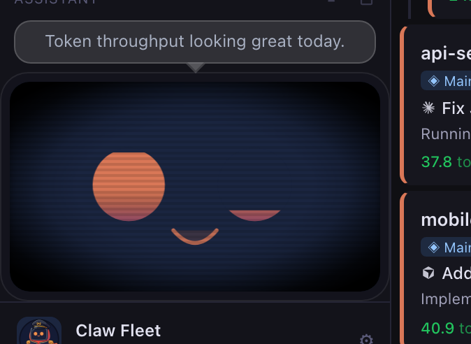
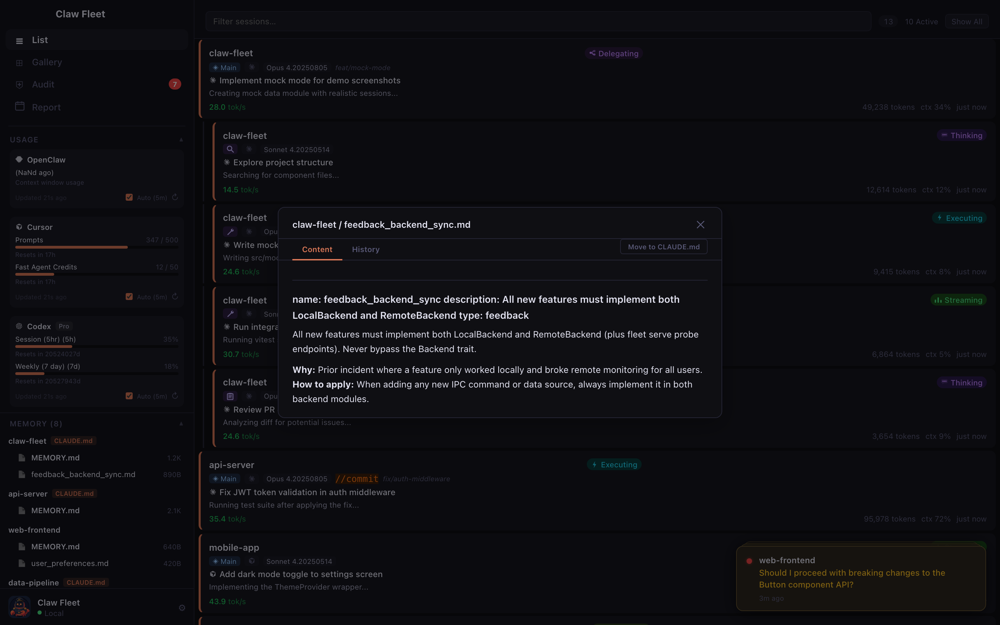
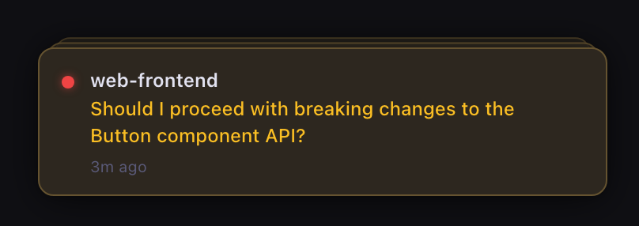
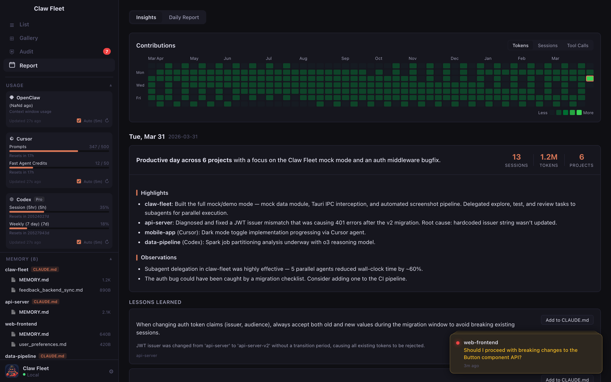
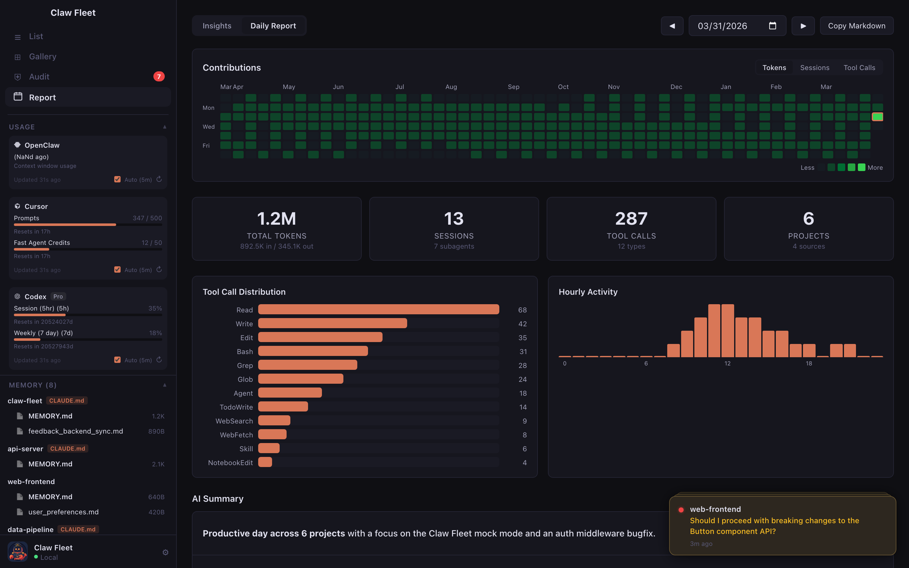

<div align="center">



# Claw Fleet

**Your agents write the code. The task never dies on your watch.**
Everyone else hands you a team of AI personas to manage. Claw Fleet keeps a single long task alive across context windows, restarts, and machines — relaying it from agent to agent automatically — while every decision that needs you lands in one inbox you can answer from your phone.
Supports **Claude Code**, **Cursor**, **OpenClaw**, and **Codex**.

**[▶ Watch the 66-second field guide](https://hoveychen.github.io/claw-fleet/#demo)** — Captain Claw walks all nine tips.

[](https://github.com/hoveychen/claw-fleet/releases/latest)
[](LICENSE)
[](https://github.com/hoveychen/claw-fleet/releases/latest)
[](https://tauri.app)
[](https://react.dev)
[](https://www.typescriptlang.org)

</div>

---

## What is Claw Fleet?

When you run AI coding agents across multiple projects — or lean on multi-agent delegation — three problems show up fast:

1. **You can't see them.** Which agent is stuck waiting for input? Which one is burning tokens in a loop?
2. **You can't govern them.** Agents ask questions, request permissions, and run risky commands in five different terminals — and every interruption demands *you*, at *your desk*, *right now*.
3. **You can't leave.** Step away for lunch and the whole fleet stalls on a question nobody answered.

**Claw Fleet** started as a monitoring dashboard and grew into a full command tower:

- **See everything** — live status, token speed, real USD spend, AI-written daily reports.
- **Approve anything** — every agent question, plan, permission request, and dangerous command lands in one Decision Panel.
- **Dispatch and relay** — launch new agent sessions from the app (or your phone), chain long tasks across context windows, run recurring loops.
- **From anywhere** — a mobile web app and a Feishu/Lark channel mean the fleet never waits for you to be at your desk.

No server required, no API key needed beyond what your agents already use.

**The core bet:** most tools anthropomorphize — a *team* of agent personas you orchestrate and babysit. Fleet's unit of work is the **task**, not the agent. A task outlives any single context window through automatic session-to-session **relay**; its plan and progress live on disk (`TASKS.md`, handoff chains, wiki, memory) rather than in a conversation that gets compacted away; and you step in only for the decisions that genuinely need a human. You govern by exception — the fleet does the rest.

> **Meet Captain Claw** 🦀 — our mascot. A battle-hardened crab commander who keeps every agent in formation.

---

## Captain Claw's nine tips

The [66-second field guide](https://hoveychen.github.io/claw-fleet/#demo) in one table — each tip is a real pain, and the feature that ends it:

| # | Tip | The feature |
|---|---|---|
| 1 | **Know who's actually working** | 8 live statuses + agent hierarchies → [See everything](#see-everything) |
| 2 | **Watch the bill, not the vibes** | Live USD spend, $/min chart, usage windows → [See everything](#see-everything) |
| 3 | **No unsupervised sudo on my ship** | Guard intercepts risky commands, LLM risk analysis → [Approve anything](#approve-anything--the-decision-panel) |
| 4 | **Answer with a click, not an essay** | One decision queue: questions, plans, permissions → [Approve anything](#approve-anything--the-decision-panel) |
| 5 | **Dispatch the whole fleet from one place** | Launch detached sessions from a composer → [Dispatch and relay](#dispatch-and-relay) |
| 6 | **Long task? The task never dies** | Autonomous agent→agent relay outlives any context window → [Dispatch and relay](#dispatch-and-relay) |
| 7 | **Your phone is the bridge now** | Mobile web app + push, full remote → [From anywhere](#from-anywhere) |
| 8 | **The standup writes itself** | AI daily reports, copy as Markdown → [See everything](#see-everything) |
| 9 | **Research it once, cite it forever** | The wiki: versioned, searchable, `[[slug]]`-linked → [The platform around it](#the-platform-around-it) |

---

## Supported Agents

| | Agent | Status |
|---|---|---|
| <picture><source media="(prefers-color-scheme: dark)" srcset="claw-fleet-desktop/app/assets/icons/claude.svg"><source media="(prefers-color-scheme: light)" srcset="claw-fleet-desktop/app/assets/icons/claude-dark.svg"></picture> | **Claude Code** | Fully supported — monitoring, decisions, orchestration |
| <picture><source media="(prefers-color-scheme: dark)" srcset="claw-fleet-desktop/app/assets/icons/cursor.svg"><source media="(prefers-color-scheme: light)" srcset="claw-fleet-desktop/app/assets/icons/cursor-dark.svg"></picture> | **Cursor** | Monitoring supported — opt-in via Settings |
| <picture><source media="(prefers-color-scheme: dark)" srcset="claw-fleet-desktop/app/assets/icons/openclaw.svg"><source media="(prefers-color-scheme: light)" srcset="claw-fleet-desktop/app/assets/icons/openclaw-dark.svg"></picture> | **OpenClaw** | Monitoring supported |
| <picture><source media="(prefers-color-scheme: dark)" srcset="claw-fleet-desktop/app/assets/icons/codex.svg"><source media="(prefers-color-scheme: light)" srcset="claw-fleet-desktop/app/assets/icons/codex-dark.svg"></picture> | **Codex** | Monitoring supported |

> Decision routing, plan approval, and orchestration features are built on Claude Code's hooks & MCP; monitoring works for all sources. Claw Fleet auto-detects which tools are installed.

---

## Screenshots

<table>
<tr>
<td width="50%"><strong>Gallery View</strong> — multi-agent dashboard</td>
<td width="50%"><strong>Session Detail</strong> — multi-subagent hierarchy</td>
</tr>
<tr>
<td></td>
<td></td>
</tr>
<tr>
<td><strong>Security Audit</strong> — tool-use risk scanning</td>
<td><strong>Captain Claw</strong> — your AI fleet assistant</td>
</tr>
<tr>
<td></td>
<td></td>
</tr>
<tr>
<td><strong>Memory</strong> — cross-session knowledge</td>
<td><strong>Notifications</strong> — waiting & audit alerts</td>
</tr>
<tr>
<td></td>
<td></td>
</tr>
<tr>
<td><strong>Insights Timeline</strong> — AI summaries & lessons feed</td>
<td><strong>Daily Report</strong> — metrics, charts & AI summary</td>
</tr>
<tr>
<td></td>
<td></td>
</tr>
</table>

---

## See everything

**8 live statuses, not just "running".** Thinking, executing, streaming, delegating, waiting for you — with parent–child agent hierarchies grouped automatically. Stuck agent? Kill or interrupt it from the dashboard.

**Cost tracking that matches your bill.** Live **USD spend per session** on every card — cached reads, cache writes, input/output pricing, and per-model rates all accounted for. Delegating agents show their own cost *and* the aggregate across every subagent they spawned. A fleet-wide **$/min chart** with a rolling 5-minute window catches runaway loops before they drain your account, and a **today counter** in the nav bar keeps the running total in sight.

**Session detail that goes deep.** Full conversation timeline with thinking blocks, tool calls, and diffs; a **workflow DAG** that redraws multi-agent orchestration as a live graph; **handoff chains** showing how a long task relayed across sessions; skill invocation history; the session's scratchpad; its TODO progress.

**AI daily summaries — the standup update you never write.** Each day's sessions distilled into a narrative: what got built, what completed, where agents got stuck. Copy as Markdown, paste into Slack.

**Lessons learned — AI mistakes become team knowledge.** Claw Fleet scans logs for missteps and extracts concise lessons. One click adds them to your `CLAUDE.md`, so agents never repeat the same mistake.

**Security audit built in.** Every Bash command your agents ran gets scanned and classified by risk — plus custom audit rules and AI-suggested new ones.

**Ambient awareness.** A **Lite mini-window** and a **tray panel** keep the essentials on screen; optional **TTS** reads summaries aloud; full-text search (FTS5) finds any conversation ever; Captain Claw's eyes track your usage ring.

---

## Approve anything — the Decision Panel

Everything that needs a human lands in **one card queue**, instead of five scattered terminals:

- **Guard** — risky Bash commands intercepted before they run, with on-demand LLM risk analysis and "always allow this prefix".
- **Permission prompts** — Claude Code's native permission requests, bridged from headless sessions.
- **Agent questions** — `AskUserQuestion` answered through a step-by-step wizard: options, forms, attachments, custom answers.
- **Plan approval** — review an agent's plan before it starts working; edit it right in the card, then approve or reject.
- **Rich cards** — agents can render forms, image galleries, even full A2UI interfaces to ask better questions.

A **floating decision window** pops cards up even when the main window is minimized. Every decision is recorded in history.

**Interaction discipline, opt-in per feature:** *Interaction Mode* turns every agent report into a decision card; *PRD Mode* keeps long multi-step tasks running without commit-nagging and survives context compression; the *permissions injector* makes Fleet the single approval gate (no double-prompting); rate-limited sessions can **auto-resume** when the window resets.

---

## Dispatch and relay

**Launch sessions from the app.** Pick a workspace, write the prompt, choose model / reasoning effort / permission mode, attach context files — Fleet spawns a detached headless session and the launchpad manages them in tabs. Works from the phone too.

**Autonomous relay — the task is the unit, not the agent.** When context runs long, an agent registers `fleet handoff --note "..."` and Fleet itself — no human, no API — spawns a successor in the same workspace, handing it the note as an opening brief and re-injecting the `TASKS.md` plan. One long task survives across any number of context windows this way; the full relay chain stays visible (`接力 n/N`) on every card. It's context-engineering as infrastructure, not a team of personas to manage.

**Loops that actually survive.** `fleet loop create --interval 30m --prompt "..."` re-runs a prompt on schedule, each iteration a fresh detached session — reliable where in-session timers die with the turn.

**Plans on disk.** `fleet plan` keeps multi-step task lists in `TASKS.md` — multiple plans in parallel, per-session attribution, progress visible on every session card.

**Agents that manage agents.** `fleet skill install` teaches your agents the Fleet CLI — they can check system load, watch each other, and stop runaway peers. Installs into Claude Code, GitHub Copilot, and Gemini CLI.

---

## From anywhere

**Your phone is a full remote.** Scan a QR code and the **mobile web app** (add it to your home screen) connects through a relay: the decision inbox with all card types, live task list with stop/interrupt, session detail down to token breakdowns and workflow trees, the wiki, even `git push`/`pull` on your repos. Web Push notifies you the moment a card arrives.

**Which means the fleet stops waiting for your desk.** Kick off a task from the couch, approve a migration from the school run, unblock a stuck agent from a café — agents keep working around the clock because the human bottleneck travels with you.

- The desktop dials *out* to the relay — **no port forwarding, no VPN**.
- Channels are gated by a shared secret (only its SHA-256 touches the server) over TLS; rotate the key any time.
- The public relay works out of the box; self-hosting is one container.

**Remote machines, local dashboard.** Point Fleet at a cloud box over SSH and its agents appear next to local ones — it bootstraps itself on the remote side. Every CLI command takes `--remote <host>`.

---

## The platform around it

**A wiki for everything your agents produce.** `fleet wiki publish` archives HTML reports, interactive demos, and markdown docs — versioned on every re-publish, full-text searchable, rendered live (scripts and all) on desktop and mobile. Docs cite each other with `[[slug]]` cross-references, organize into virtual folders, and any later session reads them back with `fleet wiki cat` — research once, cite forever.

**Repos view.** Browse workspace file trees, git status and diffs, and run commands in a built-in terminal — including on remote backends.

**Plugins & skills.** Browse and install Claude Code plugins from marketplaces; view and edit installed skills without leaving the app.

**A CLI for everything.** `fleet agents`, `stop`, `interrupt`, `speed`, `account`, `search`, `audit`, `report`, `memory`, `wiki`, `plan`, `handoff`, `loop`, `serve` — most with `--json`. Stay in the terminal if that's your thing.

**Zero config.** Download. Open. It reads local session files directly — no server, no API key, no signup. macOS, Windows, Linux.

---

## Installation

Download the latest pre-built binary for your platform from the [Releases page](https://github.com/hoveychen/claw-fleet/releases/latest):

| | Platform | Architecture | Download |
|---|---|---|---|
|  | macOS | Universal (Intel + Apple Silicon) | [claw-fleet-macos.pkg](https://github.com/hoveychen/claw-fleet/releases/latest/download/claw-fleet-macos.pkg) |
|  | Windows | x64 / ARM64 | [claw-fleet-windows-x64-setup.exe](https://github.com/hoveychen/claw-fleet/releases/latest/download/claw-fleet-windows-x64-setup.exe) |
|  | Linux | x86\_64 | [claw-fleet-linux-x64.deb](https://github.com/hoveychen/claw-fleet/releases/latest/download/claw-fleet-linux-x64.deb) · [claw-fleet-linux-x64.AppImage](https://github.com/hoveychen/claw-fleet/releases/latest/download/claw-fleet-linux-x64.AppImage) |

The mobile app needs no install — enable **Mobile** in the desktop app and scan the QR code.

### Prerequisites

Claw Fleet reads session data written by **Claude Code** (`claude` CLI). You need Claude Code installed and at least one session run before anything shows up. Cursor, OpenClaw, and Codex sources can be enabled in Settings.

---

## Build from Source

### Requirements

- [Rust](https://rustup.rs) (stable, 1.77+)
- [Node.js](https://nodejs.org) 20+ with [pnpm](https://pnpm.io)
- [Tauri CLI v2 prerequisites](https://tauri.app/start/prerequisites/)

### Steps

```bash
git clone https://github.com/hoveychen/claw-fleet.git
cd claw-fleet/claw-fleet-desktop

pnpm install

# Development (hot-reload)
pnpm tauri:dev

# Production build
pnpm tauri:build
```

The output binary and installer are placed under `target/release/bundle/`.

---

## How It Works

**Monitoring** reads directly from each agent's local data directory (for Claude Code, `~/.claude/`) — append-only JSONL conversation logs and lock files. OS-native file events (FSEvents / inotify) pick up new lines the moment they're written; status, token speed, and cost are derived in-process in the Tauri Rust backend. No network calls, nothing to configure.

**Decisions** ride on Claude Code's extension points: hooks (guard, questions, plan approval, PRD context) and MCP tools (`fleet__ask`, `fleet__render_a2ui`, `fleet__permission_prompt`) route into a local hooks server. Desktop panel, floating window, and mobile app are surfaces over the same queue — answering on any of them unblocks the waiting agent.

**Remote & mobile:** an SSH-bootstrapped `fleet serve` probe exposes the same data plane for remote machines; for mobile, the desktop dials out to a content-agnostic relay over WebSocket, and your phone joins the channel with the shared key from the QR code.

```
agents (Claude Code / Cursor / OpenClaw / Codex)
   │  JSONL + lock files            hooks + MCP
   ▼                                    ▼
 file watcher ──────────────► Fleet core (Rust)
                                   │
        ┌──────────┬───────────────┼──────────────┐
        ▼          ▼               ▼              ▼
    desktop UI  floating card   mobile PWA    fleet CLI
                                (via relay)    (--json)
```

---

## Contributing

Pull requests are welcome! A few pointers:

- **Core** is Rust in `claw-fleet-core/src/` — session parsing, watchers, hooks server, decision routing
- **Desktop** is Tauri: Rust glue in `claw-fleet-desktop/src/`, React + TypeScript UI in `claw-fleet-desktop/app/`
- **CLI** lives in `fleet-cli/`, the mobile web app in `mobile-web/`, the relay in `fleet-relay/`
- **i18n** — locale files live in `claw-fleet-desktop/app/locales/`

Please open an issue before starting large changes so we can coordinate.

By submitting a pull request, you agree to the [Contributor License Agreement (CLA)](CLA.md). The CLA grants the project owner the right to relicense contributions under other licenses (including commercial ones) while keeping the public release under AGPL-3.0.

---

## License

This project is licensed under the [GNU Affero General Public License v3.0](LICENSE) (AGPL-3.0-only).

Copyright © 2025 hoveychen

Under AGPL-3.0, if you run a modified version of this software to provide a service over a network, you must make the complete source code of your modified version available to users of that service.
